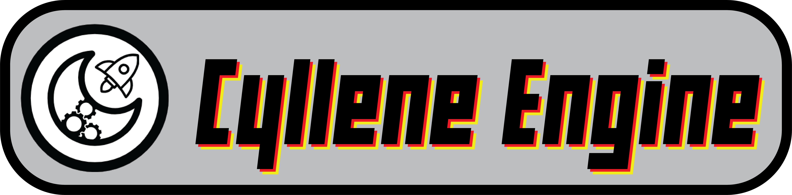

| Branch      | Status      |
| ----------- | ----------- |
| Main        |        |
| Utilities   |         |
| DirectX11   |         |
| OpenGL   |         |

Cyllene Engine is a 2D game engine that supports network, custom shading, multiplayer, physics and scripting.

## Dependencies
Cyllene Engine uses several libraries that are built, hosted and mantained in the
[Cyllene Dependencies](https://github.com/USwampertor/CylleneDependencies) git public to anyone. The Dependency is also included as a submodule in this project in ./cyEngine/

To access the dependencies, Cyllene Engine has a defined Environment Variable

CYLLENE_DEPENDENCIES
This should point to the CylleneDependencies folder, whether you use the submodule or decide to download the git in another location.

* https://github.com/cginternals/cppfs
* https://github.com/aantron/better-enums

## Collaborators

| |  |
| ---- | ---- |
| [Swampertor](https://github.com/USwampertor) | [Yostarduck](https://github.com/Yostarduck) |

