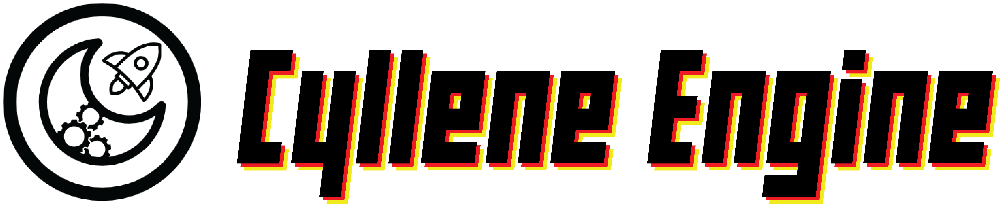

| Branch      | Status      |
| ----------- | ----------- |
| Main        |        |
| Utilities   |         |
| OpenGL   |         |

Cyllene Engine is a 2D game engine that supports network, custom shading, multiplayer, physics and scripting.

## Dependencies
%DEVLIBS%/MyLibrary/lib/$(Configuration)

* https://github.com/cginternals/cppfs
* https://github.com/aantron/better-enums

## Collaborators

| |  |
| ---- | ---- |
| [Yostarduck](https://github.com/Yostarduck) | [Swampertor](https://github.com/USwampertor) |

